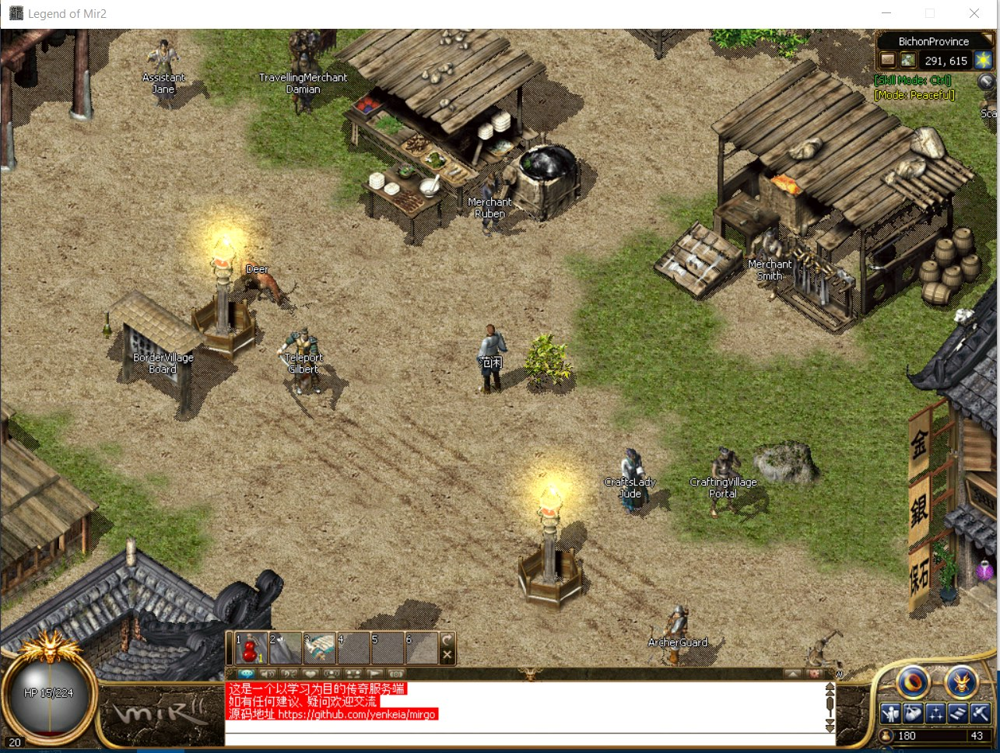

传奇服务端 go 语言实现
--------------------
参照[C#传奇](https://github.com/Suprcode/mir2)，实现一个可玩的游戏服务端

截图
--------------------

环境搭建
--------------------
  * [安装golang环境](http://docscn.studygolang.com/doc/install)
  * [设置拉取依赖代理](https://goproxy.io/zh/)
  * 获取服务端资源 git clone https://gitee.com/wrq2/mir2ServerRelease.git
  * 获取服务端代码 git clone https://github.com/yenkeia/mirgo.git

编译运行
--------------------
  * 进入目录 mirgo/cmd/server
  * 新建 config.toml, 文件内容 DataPath="服务端资源绝对路径(mir2ServerRelease)"
  * go mod vendor 
  * go build 
  * ./server
  
联系方式
--------------------
  * QQ 群: 32309474

客户端
--------------------
  * [客户端代码](https://gitee.com/wrq2/mir2.git)，感谢 https://github.com/cjlaaa/mir2 的汉化
  * [客户端资源](https://pan.baidu.com/s/1ELI8pO278v9JRyt6lS-A8Q) 提取码: 0nc3

感谢贡献者
--------------------
  * @qcdong2016 
  * @firma

参考资料
--------------------
- [LOMCN](https://www.lomcn.org/forum/)
- [知乎 - 行为树](https://www.zhihu.com/search?type=content&q=%E8%A1%8C%E4%B8%BA%E6%A0%91)
- [行为树概念与结构](https://zhuanlan.zhihu.com/p/92298402)
- [行为树（Behavior Tree）实践（1）– 基本概念](http://www.aisharing.com/archives/90)
